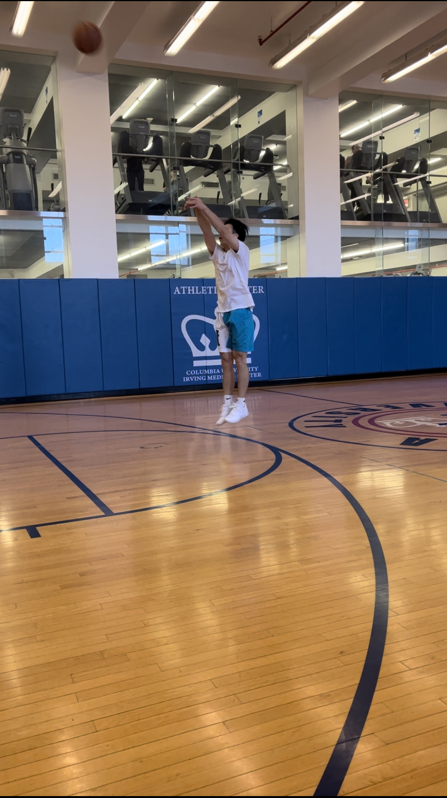
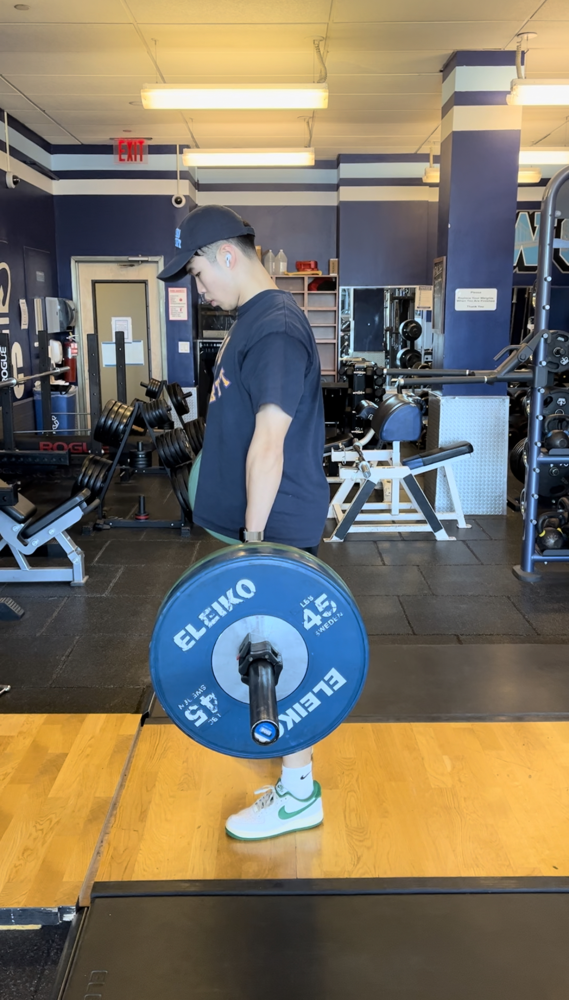

# Hi everyone

* Welcome to Xicheng Xie's website. I am a first-year MS student at Columbia University Mailman School of Public Health Department of Biostatistics. I like my major biostatistics. Cleaning data and trying to discover the logic behind the data make me feel satisfied. 
* I am a sneakerhead, a basketball and workout fanatic. Study, workout, eat, and sleep. I am living an extraordinary boring life, which is very **exciting**.

{width=30%}{width=30%}

# Know more about me

You can know more about me through my [resume](resume.html)

# Course note of P8105
[Here's](dashboard_AirBNB.html) a page with `plotly` plots using `flexdashboard` template which is the class code of `ploty and flexdashboard` part in **P8105**.

# Homework 4_problem 2
[Here's](hw4_problem2.html) the page of problem 2 of homework4, which is using dataset `NY NOAA` to make a dashboard.